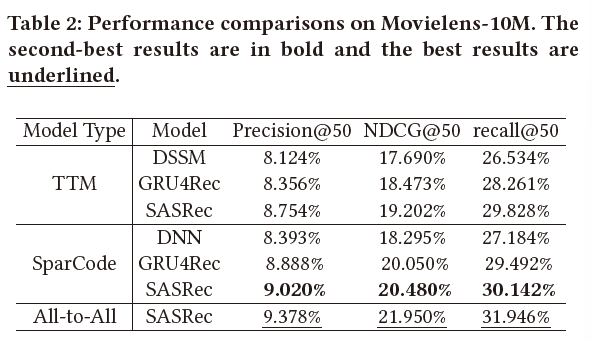

# SparCode
**Beyond Two-Tower Matching: Learning Sparse Retrievable Interaction Models for Recommendation** (WWW' 2023 Submitted) only for demonstration.

Liangcai Su, **Haoyi Duan**, Jieming Zhu, Fan Yan, Xi Xiao, Zhou Zhao, Zhenhua Dong and Ruiming Tang

## Introduction

Retrieval matching plays an essential role in search applications and recommender systems including sparse and dense retrieval. Inspired by sparse retrieval, we propose the first matching framework **SparCode** that supports both arbitrary forms of all-to-all interaction models and sparse inverted indexing. We design a code-based sparse inverted indexing based on **Product Quantization** and **sparse scoring** to ensure efficient inference, and employ all-to-all interaction models to improve retrieval accuracy. Specifically, we use product quantization to encode the query representation into discrete codes from finite codebooks, which disguisedly constrains the size of the query. Such a constraint makes it possible to pre-compute intermediate results. To address the storage challenge brought by the large number of (query, item) pairs, the core observation is that a query is irrelevant to the vast majority of candidates, implying that not all scores are worthy of being cached. Thus, we combine the discrete codes obtained by PQ to design the code-based inverted indexing mechanism to save only part of the scores, and its efficiency of online inference has been verified by sparse retrieval. 

Figure 1. Two Tower Model and All-to-all Interaction Model.

In this paper, based on the above motivations, we propose a all-to-all interaction framework SparCode for recommendation that supports a code-based sparse inverted indexing mechanism. Our goal is improving accuracy with the help of enhanced feature interactions while keeping inference efficient. Moreover, as our analysis and motivation are pervasive, it means that our solution is scalable and transferable to other tasks, such as cross-modal retrieval. Our contributions are summarized as follows:

- To the best of our knowledge, SparCode is the first matching framework that supports both arbitrary forms of all-to-all interaction and controllable sparse inverted indexing.
- SparCode converts queries conversion to discrete codes, constrains the number of indexes and makes pre-computed scores possible. Besides, our code-based sparse inverted indexing scheme reduces the pressure on memory and speeds up online services.
- Adequate experiments for recommendation show that SparCode offers a significant improvement in accuracy, as well as comparable efficiency to the ANN framework with the help of sparse inverted indexes.

## Methodology

Figure 2. Overview of SparCode.

An overview of SparCode is shown in Figure 2. To summarize, Tokenizer and Quantizer are designed to obtain multiple discrete representations of a query, thus supporting sparse inverted indexes for maintaining efficiency. All-to-all interaction-based scorer enhances the interaction between query and item for improving accuracy. Briefly, we compare the differences between the two-tower model, the all-to-all interaction model, and our SparCode as follows.

$$
score = E_1(q) \circ E_2(c)\ \ \ \ (1)
$$

$$
score = E(q,c) \ \ \ \ (2)
$$

$$
score = \sum_k E\big(\mathcal{T}_k(q),c\big) \ \ \ \ (3)
$$

where $q$ and $c$ represent a query and item respectively; $E_1(\cdot)$ and $E_2(\cdot)$ are query and item encoder respectively, and $E(\cdot)$ refers to the all-to-all interaction encoder and obtains the score, and $\mathcal{T}(\cdot)$ refers to the Tokenizer and Quantizer, which converts $q$ into a token embedding and look for alternative representations and codes.

With these equations, we highlight the design motivation of SparCode. The two tower models (i.e. Eq. 1) adopts dot product scoring is to support efficient embedding-based retrieval. The all-to-all interaction models (i.e. Eq. 2) supports arbitrarily advanced encoder for fine-grained feature interaction. Usually Eq. 2 is used for ranking in a few candidates due to inefficient inference. SparCode (i.e. Eq. 3), based on Eq. 2, defines the total score function as the sum of the scores between each token and a candidate. With this definition, SparCode not only introduces a powerful all-to-all models but also achieves efficient retrieval similar to sparse retrieval.

Figure 3. Comparison of SparCode and Two-tower Model.

## Experiments

## Conclusion

In this paper, we first summarize the advantages and limitations of sparse retrieval, the two-tower models and the all-to-all interaction models. Considering both accuracy and efficiency, we propose the first matching framework SparCode for recommendation supporting both arbitrary advanced all-to-all interaction models and sparse inverted indexing. Specifically, SparCode implements sparse inverted indexing based on PQ and sparsity control for keeping
efficiency, and a fine-grained calculation of scores based on the all-to-all interaction model for improving accuracy. Extensive experimental results on two datasets show that SparCode has far superior performance and comparable efficiency to the two-tower matching.
